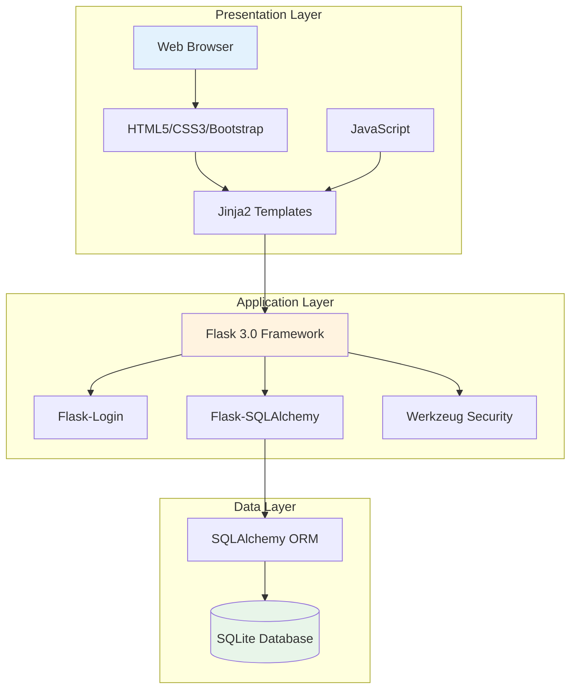
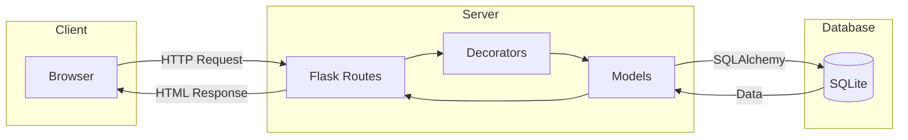
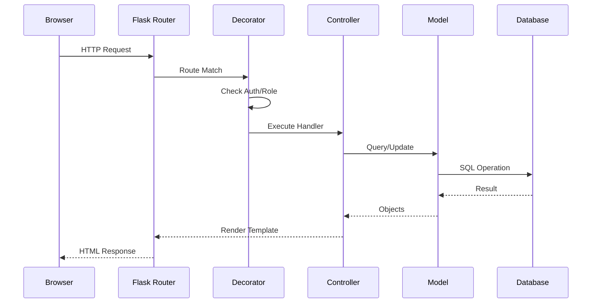
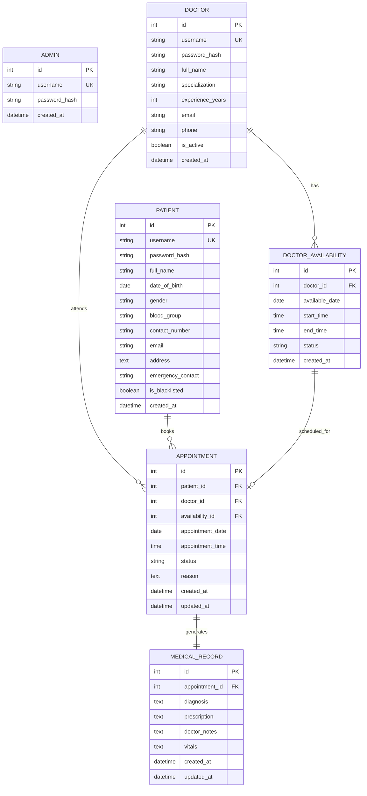
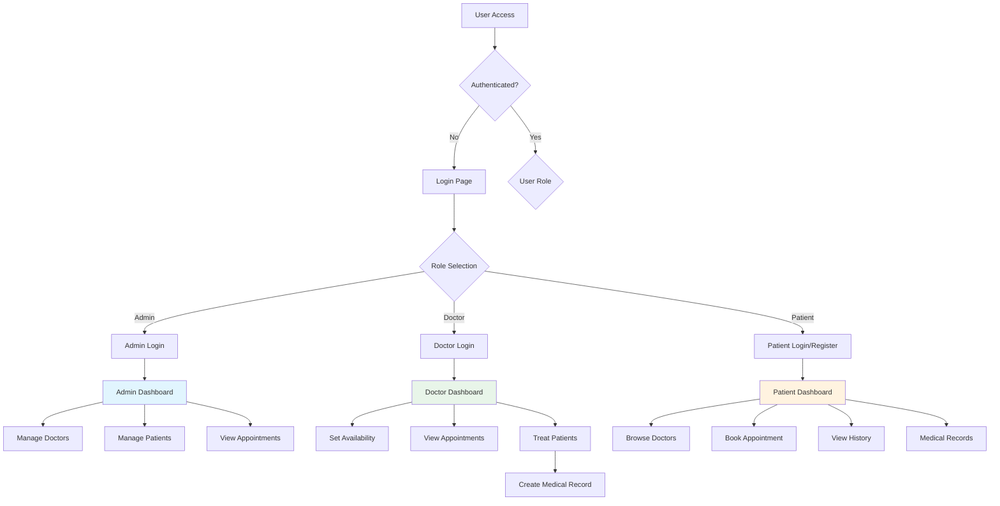
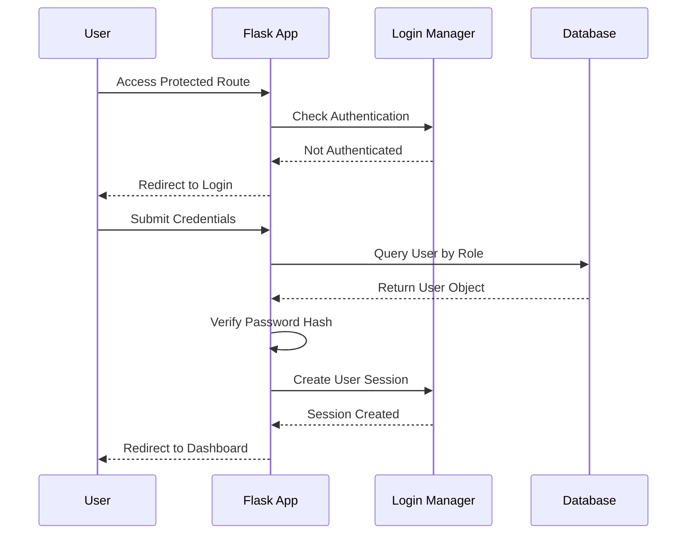
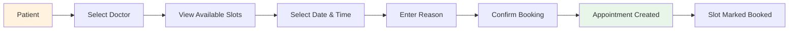

# MediCare+ Hospital Management System

## Project Documentation

**Project Name:** MediCare+  
**Developer:** Virendra Jain  
**Technology:** Python Flask, SQLite, Bootstrap 5  
**Version:** 1.0  

---

## Table of Contents

1. [Introduction](#introduction)
2. [Problem Statement](#problem-statement)
3. [Proposed Solution](#proposed-solution)
4. [System Architecture](#system-architecture)
5. [Features](#features)
6. [Technology Stack](#technology-stack)
7. [Database Design](#database-design)
8. [User Roles](#user-roles)
9. [Installation Guide](#installation-guide)
10. [Screenshots](#screenshots)
11. [Future Scope](#future-scope)
12. [Conclusion](#conclusion)

---

## Introduction

MediCare+ is a comprehensive hospital management system designed to streamline healthcare operations. The application provides a unified platform for hospital administrators, doctors, and patients to manage appointments, medical records, and hospital resources efficiently.

The system aims to digitize traditional paper-based hospital workflows, reducing manual effort and improving the overall patient experience. It offers role-based access control, ensuring that each user type has access to relevant features and data.

---

## Problem Statement

Traditional hospital management faces several challenges:

- Manual appointment booking leads to long waiting times and scheduling conflicts
- Paper-based medical records are prone to loss and difficult to retrieve
- Lack of real-time visibility into doctor availability
- Inefficient communication between hospital staff and patients
- Difficulty in tracking patient history across multiple visits
- Administrative overhead in managing doctors and hospital operations

These issues result in poor patient satisfaction, operational inefficiencies, and increased workload for hospital staff.

---

## Proposed Solution

MediCare+ addresses these challenges by providing:

- An online appointment booking system with real-time availability
- Digital medical records accessible to both doctors and patients
- Automated scheduling based on doctor availability slots
- Role-based dashboards for administrators, doctors, and patients
- Patient history tracking for better diagnosis and treatment
- Admin tools for managing hospital operations efficiently

The system is built as a web application, making it accessible from any device with an internet connection.

---

## System Architecture

The application follows a three-tier architecture:

### Architecture Diagram



### Component Interaction



### Presentation Layer
- HTML5, CSS3, Bootstrap 5.3 for responsive UI
- JavaScript for client-side interactivity
- Jinja2 templating for dynamic content rendering

### Application Layer
- Flask 3.0 web framework
- Flask-Login for authentication management
- Flask-SQLAlchemy for database operations
- Werkzeug for password hashing

### Data Layer
- SQLite database for data persistence
- SQLAlchemy ORM for database abstraction

### Request-Response Flow



---

## Features

### Admin Portal

| Feature | Description |
|---------|-------------|
| Dashboard | View hospital statistics including total doctors, patients, and appointments |
| Doctor Management | Add, edit, activate, or deactivate doctors |
| Patient Management | View all patients, blacklist or remove patients |
| Appointment Overview | Monitor all appointments across the hospital |

### Doctor Portal

| Feature | Description |
|---------|-------------|
| Dashboard | View today's appointments and quick statistics |
| Availability Management | Set and manage available time slots |
| Patient Consultation | View patient history during appointments |
| Medical Records | Add diagnosis, prescription, and treatment notes |
| Appointment Workflow | Mark appointments as completed |

### Patient Portal

| Feature | Description |
|---------|-------------|
| Self-Registration | Create an account without admin intervention |
| Doctor Search | Browse doctors by specialization |
| Appointment Booking | Book appointments in available slots |
| Appointment Management | View upcoming appointments and cancel if needed |
| Medical History | Access past appointments and prescriptions |
| Profile Management | Update personal information |

---

## Technology Stack

### Backend Technologies

| Technology | Purpose |
|------------|---------|
| Python 3.9+ | Programming language |
| Flask 3.0 | Web application framework |
| Flask-Login 0.6.3 | User session management |
| Flask-SQLAlchemy 3.1.1 | Database ORM |
| Werkzeug | Password hashing and utilities |

### Frontend Technologies

| Technology | Purpose |
|------------|---------|
| HTML5 | Page structure |
| CSS3 | Styling and layout |
| Bootstrap 5.3 | Responsive UI framework |
| Bootstrap Icons | Icon library |
| JavaScript | Client-side interactions |
| Google Fonts (Inter) | Typography |

### Database

| Technology | Purpose |
|------------|---------|
| SQLite 3 | Lightweight relational database |
| SQLAlchemy | Object-relational mapping |

---

## Database Design

### Entity-Relationship Diagram



### Application Flow Diagram



### User Authentication Flow



### Appointment Booking Flow



### Entity Descriptions

**Admin**
- Stores administrator credentials for hospital management
- Has full access to all system features

**Doctor**
- Contains doctor profiles with specialization and experience
- Linked to availability slots and appointments

**Patient**
- Stores comprehensive patient information
- Includes medical details like blood group and emergency contact

**DoctorAvailability**
- Time slots when doctors are available for consultation
- Status changes from Available to Booked when appointment is made

**Appointment**
- Central entity connecting patients with doctors
- Tracks booking status: Booked, Completed, or Cancelled

**MedicalRecord**
- Stores diagnosis, prescription, and treatment notes
- One-to-one relationship with appointments

---

## User Roles

### Administrator
- Full access to hospital management features
- Can add and manage doctors
- Can view and manage all patients
- Can monitor all appointments
- Default credentials: admin / admin123

### Doctor
- Access to personal dashboard
- Can manage own availability
- Can view assigned patient appointments
- Can add medical records and prescriptions
- Created by administrator

### Patient
- Self-registration capability
- Can book and cancel appointments
- Can view personal medical history
- Can update profile information

---

## Installation Guide

### Prerequisites

- Python 3.9 or higher installed
- pip package manager
- Web browser (Chrome, Firefox, Edge, or Safari)

### Step-by-Step Installation

1. Navigate to the project directory:
   ```
   cd Project_Hospital
   ```

2. Create a virtual environment:
   ```
   python -m venv venv
   ```

3. Activate the virtual environment:
   
   Windows:
   ```
   .\venv\Scripts\activate
   ```
   
   macOS/Linux:
   ```
   source venv/bin/activate
   ```

4. Install required packages:
   ```
   pip install -r requirements.txt
   ```

5. Start the application:
   ```
   python app.py
   ```

6. Access the application:
   ```
   http://localhost:5000
   ```

---

## Screenshots

The application features a modern, responsive design with the following key interfaces:

- Login and Registration pages with clean form layouts
- Admin dashboard with statistics cards and data tables
- Doctor dashboard with appointment calendar
- Patient portal with doctor search and booking interface
- Medical records view with prescription details
- Responsive sidebar navigation

---

## Key Code Implementations

This section highlights some unique and well-designed code patterns used in the project.

### 1. Role-Based User Loader

The application uses a composite ID pattern to handle multiple user types with Flask-Login:

```python
@login_manager.user_loader
def load_user(user_id):
    """Load user based on composite ID (role_id)"""
    if user_id.startswith('admin_'):
        return Admin.query.get(int(user_id.split('_')[1]))
    elif user_id.startswith('doctor_'):
        return Doctor.query.get(int(user_id.split('_')[1]))
    elif user_id.startswith('patient_'):
        return Patient.query.get(int(user_id.split('_')[1]))
    return None
```

Each user model generates its unique ID:

```python
def get_id(self):
    return f"doctor_{self.id}"

@property
def role(self):
    return 'doctor'
```

### 2. Custom Decorator for Role-Based Access Control

Decorators enforce access restrictions without cluttering route logic:

```python
def admin_required(f):
    """Decorator to require admin role"""
    @wraps(f)
    @login_required
    def decorated_function(*args, **kwargs):
        if current_user.role != 'admin':
            flash('Access denied. Admin privileges required.', 'danger')
            return redirect(url_for('login'))
        return f(*args, **kwargs)
    return decorated_function

def doctor_required(f):
    """Decorator to require doctor role"""
    @wraps(f)
    @login_required
    def decorated_function(*args, **kwargs):
        if current_user.role != 'doctor':
            flash('Access denied. Doctor privileges required.', 'danger')
            return redirect(url_for('login'))
        if not current_user.is_active:
            flash('Your account has been deactivated.', 'danger')
            logout_user()
            return redirect(url_for('login'))
        return f(*args, **kwargs)
    return decorated_function
```

Usage in routes:

```python
@app.route('/admin/dashboard')
@admin_required
def admin_dashboard():
    # Only admins can access this route
    pass
```

### 3. Dynamic Age Calculation Property

The Patient model calculates age dynamically from date of birth:

```python
@property
def age(self):
    if self.date_of_birth:
        today = datetime.today()
        return today.year - self.date_of_birth.year - (
            (today.month, today.day) < (self.date_of_birth.month, self.date_of_birth.day)
        )
    return None
```

### 4. Secure Password Handling

Passwords are never stored in plain text. Werkzeug handles hashing:

```python
from werkzeug.security import generate_password_hash, check_password_hash

class Doctor(UserMixin, db.Model):
    password_hash = db.Column(db.String(256), nullable=False)
    
    def set_password(self, password):
        self.password_hash = generate_password_hash(password)
    
    def check_password(self, password):
        return check_password_hash(self.password_hash, password)
```

### 5. Availability Slot Validation

The system prevents scheduling conflicts and past date bookings:

```python
@app.route('/doctor/availability', methods=['GET', 'POST'])
@doctor_required
def doctor_availability():
    if request.method == 'POST':
        slot_date = datetime.strptime(available_date, '%Y-%m-%d').date()
        slot_start = datetime.strptime(start_time, '%H:%M').time()
        slot_end = datetime.strptime(end_time, '%H:%M').time()
        
        # Validate date is in future
        if slot_date < date.today():
            flash('Cannot add availability for past dates.', 'danger')
        elif slot_start >= slot_end:
            flash('End time must be after start time.', 'danger')
        else:
            # Check for overlap
            existing = DoctorAvailability.query.filter(
                DoctorAvailability.doctor_id == current_user.id,
                DoctorAvailability.available_date == slot_date,
                DoctorAvailability.start_time == slot_start
            ).first()
            
            if existing:
                flash('This slot already exists.', 'warning')
            else:
                # Create new slot
                slot = DoctorAvailability(...)
                db.session.add(slot)
                db.session.commit()
```

### 6. Dashboard Statistics with SQLAlchemy

Efficient queries for dashboard metrics:

```python
@app.route('/admin/dashboard')
@admin_required
def admin_dashboard():
    stats = {
        'total_doctors': Doctor.query.count(),
        'active_doctors': Doctor.query.filter_by(is_active=True).count(),
        'total_patients': Patient.query.count(),
        'total_appointments': Appointment.query.count(),
        'pending_appointments': Appointment.query.filter_by(status='Booked').count(),
        'completed_appointments': Appointment.query.filter_by(status='Completed').count(),
    }
    
    # Get specializations count using group_by
    specializations = db.session.query(
        Doctor.specialization, 
        db.func.count(Doctor.id)
    ).filter_by(is_active=True).group_by(Doctor.specialization).all()
    
    return render_template('admin/dashboard.html', stats=stats)
```

### 7. Doctor's Daily Schedule Query

Complex filtering for appointment management:

```python
today = date.today()

# Today's appointments
todays_appointments = Appointment.query.filter(
    Appointment.doctor_id == current_user.id,
    Appointment.appointment_date == today,
    Appointment.status == 'Booked'
).order_by(Appointment.appointment_time).all()

# Upcoming appointments (next 7 days)
upcoming = Appointment.query.filter(
    Appointment.doctor_id == current_user.id,
    Appointment.appointment_date > today,
    Appointment.appointment_date <= today + timedelta(days=7),
    Appointment.status == 'Booked'
).order_by(Appointment.appointment_date, Appointment.appointment_time).all()

# Count unique patients
unique_patients = db.session.query(
    db.func.count(db.distinct(Appointment.patient_id))
).filter(Appointment.doctor_id == current_user.id).scalar() or 0
```

### 8. Cascading Relationships

SQLAlchemy relationships handle related data automatically:

```python
class Doctor(UserMixin, db.Model):
    # Cascade delete removes all availability slots when doctor is deleted
    availabilities = db.relationship(
        'DoctorAvailability', 
        backref='doctor', 
        lazy='dynamic', 
        cascade='all, delete-orphan'
    )
    
    appointments = db.relationship(
        'Appointment', 
        backref='doctor', 
        lazy='dynamic'
    )

class Appointment(db.Model):
    # One-to-one relationship with medical record
    medical_record = db.relationship(
        'MedicalRecord', 
        backref='appointment', 
        uselist=False,  # Makes it one-to-one
        cascade='all, delete-orphan'
    )
```

### 9. Patient Blacklist Feature

Blacklisted patients are prevented from logging in:

```python
@app.route('/login', methods=['GET', 'POST'])
def login():
    if request.method == 'POST':
        role = request.form.get('role', 'patient')
        
        if role == 'patient':
            user = Patient.query.filter_by(username=username).first()
            if user and user.is_blacklisted:
                flash('Your account has been suspended.', 'danger')
                return render_template('login.html')
```

### 10. Context Processor for Templates

Global template variables without passing them in every route:

```python
@app.context_processor
def inject_now():
    """Inject current datetime into templates"""
    return {'now': datetime.now()}
```

Usage in templates:

```html
<footer>Copyright {{ now.year }} MediCare+</footer>
```

---

## Future Scope

The following enhancements are planned for future versions:

1. **Email Notifications** - Appointment reminders and confirmation emails
2. **SMS Integration** - Text message alerts for appointments
3. **Payment Gateway** - Online payment for consultations
4. **Video Consultation** - Telemedicine support for remote appointments
5. **Prescription PDF** - Downloadable prescription documents
6. **Analytics Dashboard** - Detailed reports and insights for administrators
7. **Multi-language Support** - Interface translation for wider accessibility
8. **Mobile Application** - Native apps for iOS and Android
9. **Lab Integration** - Connection with laboratory systems for test results
10. **Insurance Module** - Insurance claim processing and verification

---

## Conclusion

MediCare+ provides a complete solution for hospital management needs. By digitizing appointment scheduling, medical records, and administrative tasks, the system improves operational efficiency and patient satisfaction.

The modular architecture allows for easy maintenance and future enhancements. The role-based access control ensures data security while providing a tailored experience for each user type.

This project demonstrates the application of modern web development practices using Python Flask, database design principles, and responsive UI frameworks to solve real-world healthcare challenges.

---

## Project Information

**Project Title:** MediCare+ Hospital Management System  
**Developer:** Virendra Jain  
**Development Period:** 2025  
**Framework:** Flask 3.0  
**Database:** SQLite with SQLAlchemy  
**Frontend:** Bootstrap 5.3  

---

*This documentation is prepared as part of the MediCare+ Hospital Management System project.*
